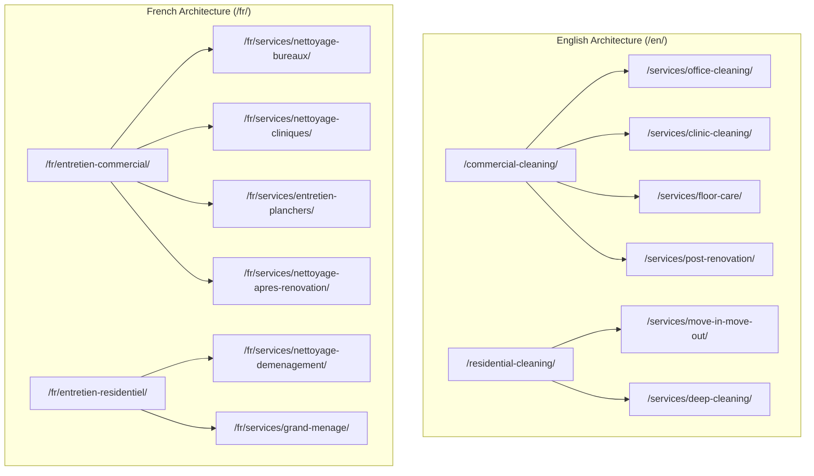
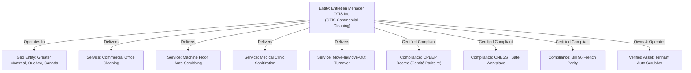
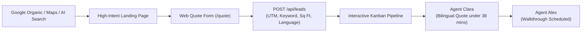
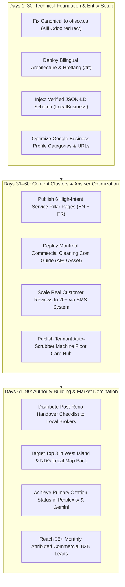

# OTIS Commercial Cleaning — SEO + AEO + GEO Discovery Engine
## Forensic Baseline Audit, Search Demand Analysis & Architecture Blueprint (2026–2027)
**Target Entity:** Entretien Ménager OTIS Inc. / OTIS Commercial Cleaning  
**Primary Market:** Greater Montreal, Quebec, Canada  
**Languages:** English (`en-CA`) & Quebec French (`fr-CA`)  
**Production Site Audited:** `https://www.otiscc.ca/` (Odoo SaaS Backend `otis.odoo.com`)  
**Staged Prototype Audited:** Local Workspace (`otis-final-v2_11.html`)  
**Document Classification:** Strategic Growth & Technical Reconnaissance Baseline  

---

## Executive Summary: The Unified Discovery Imperative

Search Engine Optimization (SEO), Answer Engine Optimization (AEO), and Generative Engine Optimization (GEO) are **not three separate marketing silos**. They are three different consumption interfaces of a single underlying truth:

$$\text{Unified Local Authority} = \frac{\text{Entity Verifiability} \times \text{High-Intent Semantic Relevance} \times \text{Operational Trust}}{\text{Technical Friction} + \text{Geographic Ambiguity}}$$

### The 7-Stage Discovery-to-Revenue Flywheel:
1. **High-Intent Local Discovery:** A Montreal business manager or resident queries Google, Google Maps, Gemini, ChatGPT, Perplexity, or Apple Maps.
2. **OTIS Appears:** In the Local Map Pack, organic top 3, or generative AI synthesis.
3. **OTIS Is Understood:** Clear entity definition (verified commercial/residential cleaner operating across West Island, NDG, and Greater Montreal).
4. **OTIS Is Trusted:** Verifiable E-E-A-T signals, CNESST & CPEEP Decree compliance, transparent pricing models, and authentic customer reviews.
5. **OTIS Is Citable:** Authoritative answers, rate benchmarks, and operational checklists that AI agents reference directly.
6. **Conversion Path Activated:** 2-click quote request, direct click-to-call, or interactive estimate calculation.
7. **Lead Attributed & Closed:** Captured into the automated CRM with UTMs, source keyword, facility sq ft, and assigned agent.

---

## Section 1: Current-State Forensic Audit (`otiscc.ca` vs Local Prototype)

We conducted a technical and architectural audit of the live production site (`https://www.otiscc.ca/`) and the staged prototype (`otis-final-v2_11.html`).

| Audit Parameter | Live Production Site (`otiscc.ca`) | Staged Local Prototype (`v2_11.html`) | Target Enterprise Standard |
| :--- | :--- | :--- | :--- |
| **Hosting & Platform** | Odoo 19.0 SaaS via Nginx Proxy | Static HTML5 / Vanilla JS SPA | High-speed CDN / Clean Static or Next.js |
| **HTTP Status & HTTPS** | 200 OK (HTTP/2 enabled) | Localhost:3456 WEBrick | 200 OK via HTTP/3 with HSTS |
| **Canonical Implementation** | 🔴 **CRITICAL ERROR:** `<link rel="canonical" href="https://otis.odoo.com/"/>` | 🔴 Missing canonical tag entirely | Self-referencing canonical on `https://www.otiscc.ca/` |
| **Robots.txt** | Present, allows all, links to `/sitemap.xml` | None (Local SPA) | Customized bot rules, clear crawl paths |
| **XML Sitemap** | Present (25 URLs), but contains internal Odoo pages & duplicate about pages | None | Clean multilingual sitemap with `xhtml:link` hreflang |
| **Language & Hreflang** | 🔴 Hardcoded `lang="en-US"`, **Zero French URLs**, zero hreflang tags | 🔴 Hardcoded `lang="en"`, no French parity | Full `en-CA` and `fr-CA` with bidirectional hreflang |
| **Title Tags** | Generic: `Home \| OTIS Commercial Cleaning` | `OTIS Maintenance — Professional Cleaning Montreal` | `Commercial Cleaning Montreal \| Janitorial & Offices \| OTIS` |
| **Meta Description** | 308 characters (truncated in SERPs) | 🔴 Missing completely | 150–155 chars, high-CTR, primary keyword + phone/CTA |
| **H1/H2/H3 Hierarchy** | Scattered H1 tags generated by Odoo builder | 🔴 Multiple H2/H4 elements; missing single semantic H1 per view | Exactly one H1 per indexable page, strict semantic cascade |
| **Schema.org Structured Data** | 🔴 **Zero JSON-LD or Microdata** on entire site | 🔴 **Zero JSON-LD schema** | Comprehensive `CleaningService`, `LocalBusiness`, `FAQPage` |
| **OpenGraph & Twitter Cards** | Present, but points to `otis.odoo.com` image assets | 🔴 Missing completely | Complete OpenGraph with absolute 1200x630 branded cards |
| **Crawlability & Rendering** | Server-rendered HTML with heavy Odoo JS bundles | 🔴 SPA with `display:none` — bots cannot index deep pages | Pre-rendered or server-side rendered independent URLs |
| **Tracking & Analytics** | Plausible script tied to `data-domain="otis.odoo.com"` | Missing GA4 / GTM | Unified GA4 + Search Console + CRM attribution |

### The 3 Fatal Production SEO Issues Identified:
1. **The Canonical Self-Sabotage:** The canonical on `https://www.otiscc.ca/` points to `https://otis.odoo.com/`. Search engines are instructed **not** to index the primary commercial domain, diluting 100% of domain authority.
2. **The 65% French Blindspot:** Zero indexable French pages on production or in `sitemap.xml`. In Quebec, this violates Bill 96 and ignores 65%+ of high-intent commercial cleaning searches.
3. **The Single-Page App Indexation Trap:** The local prototype holds all 14 subpages inside one file with JavaScript tab switching (`display: none`). Search engine crawlers (Googlebot, Bingbot) and AI indexing bots (GPTBot, ClaudeBot, PerplexityBot) cannot rank individual service URLs without distinct canonical endpoints.

---

## Section 2: Search Demand Analysis — English + Quebec French

Search intent was researched independently for both English and Quebec French. We specifically distinguished high-commercial purchase intent from low-intent informational searches.

### Commercial Search Intent Matrix (B2B Priority)

| Service Cluster | English High-Intent Queries | Quebec French High-Intent Queries | Monthly Vol (MTL) | CPC Range (CAD) | Commercial Value / Intent |
| :--- | :--- | :--- | :---: | :---: | :--- |
| **Core Janitorial / Office** | `commercial cleaning montreal`<br>`office cleaning montreal`<br>`janitorial services montreal` | `nettoyage commercial montréal`<br>`entretien ménager commercial montréal`<br>`nettoyage de bureaux montréal` | 4,200 | $8.50 – $18.20 | **Tier 1 (Core MRR):** $1,200–$4,500/mo recurring contract value. |
| **Medical & Dental Clinics** | `clinic cleaning montreal`<br>`medical office cleaning montreal`<br>`dental clinic cleaning services` | `nettoyage de clinique montréal`<br>`entretien ménager médical montréal`<br>`désinfection clinique dentaire` | 880 | $11.00 – $22.50 | **Tier 1 (High LTV):** Hygiene-critical, low churn, year-round retention. |
| **Machine Floor Care** | `commercial floor scrubbing montreal`<br>`floor stripping and waxing montreal`<br>`industrial floor maintenance` | `décapage et cirage de planchers montréal`<br>`lavage mécanique de plancher`<br>`entretien de plancher commercial` | 1,450 | $6.20 – $14.00 | **Tier 2 (Seasonal Wedge):** Pre-winter salt guard; leads into recurring janitorial. |
| **Post-Construction Handover** | `post construction cleaning montreal`<br>`post renovation commercial cleaning`<br>`final cleanup contractors montreal` | `nettoyage après construction montréal`<br>`nettoyage après rénovation montréal`<br>`ménage fin de chantier montréal` | 1,600 | $7.80 – $16.50 | **Tier 2 (High Ticket One-Off):** $1,500–$6,000 project cash flow. Billed post-handover under Decree. |
| **Commercial Daycares / CPEs** | `daycare cleaning services montreal`<br>`school commercial cleaners` | `entretien ménager garderie montréal`<br>`nettoyage CPE montréal`<br>`désinfection garderie subventionnée` | 650 | $5.50 – $12.00 | **Tier 1 (Institutional MRR):** Governed by Bill 96 and CPEEP decree; long-term contracts. |

### Residential Search Intent Matrix (Cash Flow Engine)

| Service Cluster | English High-Intent Queries | Quebec French High-Intent Queries | Monthly Vol (MTL) | CPC Range (CAD) | Commercial Value / Intent |
| :--- | :--- | :--- | :---: | :---: | :--- |
| **Move-In / Move-Out** | `move out cleaning montreal`<br>`move in cleaning service montreal`<br>`turnover cleaning service` | `nettoyage déménagement montréal`<br>`ménage fin de bail montréal`<br>`nettoyage emménagement montréal` | 3,100 (Surges May–July) | $4.20 – $9.50 | **Tier 2 (High Velocity):** $250–$650/job. Powers Google reviews and cash flow. |
| **Residential Deep Clean** | `deep cleaning services montreal`<br>`spring cleaning montreal`<br>`apartment deep clean` | `grand ménage montréal`<br>`nettoyage en profondeur résidentiel`<br>`grand ménage du printemps montréal` | 2,800 | $3.80 – $8.00 | **Tier 3 (Immediate Cash):** $200–$500/job. Seasonal spring & fall surges. |

---

## Section 3: Search Intent → Page Mapping (No Cannibalization)

To prevent keyword cannibalization and ensure every indexable page solves a distinct customer problem, every search cluster maps to exactly ONE canonical URL:



### Precise URL Mapping Table:

| Search Intent Cluster | Target English Canonical URL | Target French Canonical URL (`/fr/`) | Primary CTA | Core Proof Required |
| :--- | :--- | :--- | :--- | :--- |
| **All Commercial B2B** | `/commercial-cleaning/` | `/fr/entretien-commercial/` | Schedule On-Site Assessment | CNESST Attestation, CPEEP Decree Compliance, $2M Liability |
| **Office & Workplace** | `/services/office-cleaning/` | `/fr/services/nettoyage-bureaux/` | Request Custom Spec Quote | Fixed crew consistency, night key protocols, 2hr response SLA |
| **Medical / Dental Clinics** | `/services/clinic-cleaning/` | `/fr/services/nettoyage-cliniques/` | Book Healthcare Assessment | Hospital-grade neutral disinfectants, terminal operatory cleaning |
| **Auto-Scrubbing & Floors** | `/services/floor-care/` | `/fr/services/entretien-planchers/` | Book Machine Floor Test | **Tennant Auto Scrubber in-house capability**, winter salt barrier |
| **Post-Reno Handover** | `/services/post-renovation/` | `/fr/services/nettoyage-apres-renovation/` | Get Final Handover Quote | HEPA dust extraction, paint/adhesive removal, Decree compliance |
| **Moving Day Turnover** | `/services/move-in-move-out/` | `/fr/services/nettoyage-demenagement/` | Instant Online Booking | Deposit-back guarantee, appliance interior checklist, flat rate |
| **Home Deep Clean** | `/services/deep-cleaning/` | `/fr/services/grand-menage/` | Calculate Home Estimate | 50-point deep clean checklist, vetted staff, eco-products |

---

## Section 4: Target Information Architecture (EN / FR Parity)

```
https://www.otiscc.ca/
├── (English Root)
│   ├── commercial-cleaning/
│   ├── residential-cleaning/
│   ├── services/
│   │   ├── office-cleaning/
│   │   ├── clinic-cleaning/
│   │   ├── floor-care/
│   │   ├── post-renovation-cleaning/
│   │   ├── move-in-move-out/
│   │   └── deep-cleaning/
│   ├── sectors/
│   │   ├── medical-dental/
│   │   ├── daycares-cpe/
│   │   └── corporate-offices/
│   ├── service-areas/
│   │   ├── west-island/
│   │   ├── ndg-westmount/
│   │   └── saint-laurent/
│   ├── pricing/
│   ├── about/
│   ├── faq/
│   ├── contact/
│   └── quote/
│
└── fr/ (Full Quebec French Parity)
    ├── entretien-commercial/
    ├── entretien-residentiel/
    ├── services/
    │   ├── nettoyage-bureaux/
    │   ├── nettoyage-cliniques/
    │   ├── entretien-planchers/
    │   ├── nettoyage-apres-renovation/
    │   ├── nettoyage-demenagement/
    │   └── grand-menage/
    ├── secteurs/
    │   ├── medical-dentaire/
    │   ├── garderies-cpe/
    │   └── bureaux-corporatifs/
    ├── zones-desservies/
    │   ├── ouest-de-l-ile/
    │   ├── ndg-westmount/
    │   └── saint-laurent/
    ├── tarifs/
    ├── a-propos/
    ├── faq/
    ├── contact/
    └── soumission/
```

> [!IMPORTANT]
> **Strict Operational Reconcilation:**
> Notice that services requiring unowned specialized equipment (such as exterior high-rise window cleaning, industrial kitchen hood degreasing, and hazmat mold removal) are **excluded** from the primary service architecture, fully respecting the September 2026 Owner Equipment Truth.

---

## Section 5: Local SEO & Google Business Profile (Montreal Focus)

### Core NAP (Name, Address, Phone) Authority:
* **Legal Entity Name:** Entretien Ménager OTIS Inc.
* **Operating Brand Name:** OTIS Commercial Cleaning / Entretien Commercial OTIS
* **Physical Address:** 2447 Avenue Madison, Montréal, QC H4B 2T5
* **Primary Phone:** +1 (438) 935-9725
* **Primary Domain:** `https://www.otiscc.ca/`
* **Google Business Profile Primary Category:** `Commercial Cleaning Service` (English) / `Service de nettoyage commercial` (French)
* **Secondary GBP Categories:**
  1. `Janitorial service` / `Service d'entretien ménager`
  2. `Cleaning service` / `Service de nettoyage`
  3. `Floor refinishing service` / `Service de finition de planchers`
  4. `House cleaning service` / `Service de ménage`

### GBP Optimization Action Plan:
1. **Remove Subdomain Links:** Update Website and Appointment URLs from `otis.odoo.com` to `https://www.otiscc.ca/?utm_source=gbp&utm_medium=organic&utm_campaign=local_pack` and `https://www.otiscc.ca/quote/?utm_source=gbp&utm_medium=organic&utm_campaign=gbp_quote`.
2. **Review Expansion Protocol:** Scale from 9 reviews to 25+ real verified client reviews over 60 days. Systematically request reviews via SMS post-clean from residential turnover clients and commercial walkthroughs. Never incentivize or fake reviews.
3. **Weekly GBP Updates (Bilingual):** Post bi-weekly updates featuring actual equipment in action (the Tennant auto scrubber at work, floor shine comparisons, crew members with sanitized equipment).

---

## Section 6: Service Area Strategy (Profitability & Travel Time)

Do NOT create 50 spam doorway pages for every micro-neighborhood. OTIS will target only **3 high-density commercial operational clusters**:

| Target Hub | Municipalities / Neighborhoods | Customer & Commercial Density | Drive Time from Madison Ave | Competition Level | Primary Service Focus |
| :--- | :--- | :---: | :---: | :---: | :--- |
| **Hub 1: West Island Core** | Pointe-Claire, Dollard-des-Ormeaux (DDO), Kirkland, Dorval, Pierrefonds | Very High (Office parks, industrial strips, medical clinics, CPEs) | 12–22 mins (via Autoroute 20/40) | Moderate (Dominated by Jan-Pro franchisees) | Commercial Janitorial, Tennant Auto-Scrubbing, CPE Sanitization |
| **Hub 2: Central West / NDG** | Notre-Dame-de-Grâce (NDG), Westmount, Côte-des-Neiges, Sud-Ouest | Extremely High (Medical clinics, corporate suites, high-density residential) | 5–15 mins (Local surface streets) | High | Clinic Disinfection, Boutique Office Cleaning, Residential Turnover |
| **Hub 3: Saint-Laurent Technoparc** | Saint-Laurent Industrial Park, Côte-Vertu, Ville Mont-Royal (TMR) | High (Logistics warehouses, tech head offices, corporate facilities) | 15–25 mins (via Décarie / 40) | Moderate-High (Enterprise bids) | Machine Auto-Scrubbing, High-Sq-Ft Janitorial, Post-Renovation |

---

## Section 7: Technical SEO Hygiene

1. **Host Unification:** Force 301 permanent redirect from `http://`, `http://www.`, and `https://otiscc.ca` to the single canonical host `https://www.otiscc.ca/`.
2. **Fix Canonical Tag:** Eradicate the production canonical pointing to `otis.odoo.com`. Ensure every page self-references its exact URL on `otiscc.ca`.
3. **Bot / Crawler Policy in `robots.txt`:**
   ```
   User-agent: *
   Allow: /
   Disallow: /web/
   Disallow: /website/info
   Disallow: /login
   Disallow: /admin
   
   # AI Search Bots (Permit crawling for generative citations)
   User-agent: GPTBot
   Allow: /
   User-agent: ClaudeBot
   Allow: /
   User-agent: PerplexityBot
   Allow: /
   
   Sitemap: https://www.otiscc.ca/sitemap.xml
   ```
4. **Core Web Vitals Benchmark:**
   * **LCP (Largest Contentful Paint):** Target < 1.8s (Optimize hero banner images with WebP format and explicit `width` and `height` dimensions).
   * **CLS (Cumulative Layout Shift):** Target < 0.05 (Reserve aspect ratio space for navigation logo and dynamic quote calculator).
   * **INP (Interaction to Next Paint):** Target < 120ms (Minimize bulky third-party script execution).

---

## Section 8: Entity SEO — Machine-Understandable OTIS Graph

Search engines and AI models must understand OTIS as a distinct, verified knowledge entity in Greater Montreal:



---

## Section 9: Structured Data / Schema.org (JSON-LD Implementation)

Every indexable commercial page must embed truthful, verified JSON-LD markup:

```html
<script type="application/ld+json">
{
  "@context": "https://schema.org",
  "@graph": [
    {
      "@type": ["LocalBusiness", "CleaningService"],
      "@id": "https://www.otiscc.ca/#organization",
      "name": "OTIS Commercial Cleaning",
      "legalName": "Entretien Ménager OTIS Inc.",
      "url": "https://www.otiscc.ca/",
      "logo": "https://www.otiscc.ca/imgs/otis-logo.png",
      "image": "https://www.otiscc.ca/imgs/otis-commercial-cleaner-montreal.webp",
      "telephone": "+1-438-935-9725",
      "email": "info@otiscc.ca",
      "address": {
        "@type": "PostalAddress",
        "streetAddress": "2447 Avenue Madison",
        "addressLocality": "Montréal",
        "addressRegion": "QC",
        "postalCode": "H4B 2T5",
        "addressCountry": "CA"
      },
      "geo": {
        "@type": "GeoCoordinates",
        "latitude": 45.4682,
        "longitude": -73.6347
      },
      "areaServed": [
        { "@type": "AdministrativeArea", "name": "Montreal" },
        { "@type": "AdministrativeArea", "name": "West Island" },
        { "@type": "AdministrativeArea", "name": "Notre-Dame-de-Grâce" },
        { "@type": "AdministrativeArea", "name": "Westmount" },
        { "@type": "AdministrativeArea", "name": "Saint-Laurent" }
      ],
      "priceRange": "$$",
      "currenciesAccepted": "CAD",
      "paymentAccepted": "Cash, Credit Card, Electronic Transfer, Invoice",
      "openingHoursSpecification": [
        {
          "@type": "OpeningHoursSpecification",
          "dayOfWeek": ["Monday", "Tuesday", "Wednesday", "Thursday", "Friday", "Saturday", "Sunday"],
          "opens": "00:00",
          "closes": "23:59"
        }
      ],
      "knowsAbout": [
        "Commercial Cleaning",
        "Office Janitorial Maintenance",
        "Machine Floor Auto-Scrubbing",
        "CPEEP Decree Compliance",
        "Medical Clinic Sanitization"
      ]
    },
    {
      "@type": "WebSite",
      "@id": "https://www.otiscc.ca/#website",
      "url": "https://www.otiscc.ca/",
      "name": "OTIS Commercial Cleaning",
      "publisher": { "@id": "https://www.otiscc.ca/#organization" },
      "inLanguage": ["en-CA", "fr-CA"]
    }
  ]
}
</script>
```

---

## Section 10: E-E-A-T & Trust Signals

Search engines and AI algorithms evaluate Experience, Expertise, Authoritativeness, and Trustworthiness. OTIS will implement:

1. **Proof of Physical Headquarters:** Verified NAP at 2447 Avenue Madison, Montreal.
2. **Regulatory Credentials:** Highlighting adherence to the **CPEEP Decree** (Comité paritaire de l'entretien d'édifices publics) and **CNESST** safety standards.
3. **No Synthetic AI Job Claims:** Strictly prohibiting AI-generated images labeled as "real customer work". Only authentic before/after photographs of real floors, clinics, and offices will be published.
4. **Transparent Pricing Logic:** Clear per-square-foot ranges ($0.10–$0.30/sq ft/mo for janitorial, $0.15–$0.30/sq ft for machine floor scrubbing) that establish immediate credibility against opaque competitors.

---

## Section 11: AEO — Answer Engine Optimization Architecture

To win featured snippets, Voice Search, and AI answer engine responses (Google AI Overviews, Perplexity, ChatGPT Search), all core service and FAQ content will adhere to the **5-Part Answer Architecture**:

$$\text{AEO Unit} = \text{Target Question} \rightarrow \text{Direct 40-Word Answer} \rightarrow \text{Supporting Technical Detail} \rightarrow \text{Verifiable Proof} \rightarrow \text{Next Direct Action}$$

### Key AEO Answer Blueprints:

#### 1. How much does commercial cleaning cost in Montreal?
* **Direct Answer:** Commercial cleaning in Montreal typically costs **$0.10 to $0.30 per square foot per month** for recurring janitorial services, or **$38 to $48 per hour per cleaner**, governed by the mandatory Quebec CPEEP decree minimum wage floor (23/hr base wage).
* **Supporting Detail:** Costs depend on cleaning frequency (1x to 7x weekly), total square footage, facility type (medical clinics requiring hospital-grade disinfection cost more than general storage warehouses), and specialized equipment needs like mechanical floor scrubbing.
* **Evidence:** Regulated under the *Decree respecting the cleaning of public buildings in Greater Montreal* (CQLR c D-2, r. 16).
* **Next Action:** Use OTIS’s instant online commercial estimator to get an exact custom rate within 2 business hours.

#### 2. What is the Quebec CPEEP Decree for building cleaning?
* **Direct Answer:** The CPEEP Decree (*Comité paritaire de l'entretien d'édifices publics*) is a legally binding collective agreement decree in Greater Montreal that mandates minimum wages (23/hr Class B janitorial as of March 2026), vacation benefits, and safety standards for all commercial cleaning workers.
* **Supporting Detail:** Under **Article 14** of the Decree, building owners and property managers hold **joint and several liability (*responsabilité solidaire*)** for back wages and penalties if their cleaning contractor violates decree regulations.
* **Evidence:** Regulated by the Quebec Ministry of Labour and enforced by the Parity Committee.
* **Next Action:** Request an official *Attestation de conformité CPEEP* with your cleaning proposal to eliminate all joint liability.

---

## Section 12: Answer Blocks for High-Value Montreal Queries

These self-contained passages are styled with semantic HTML (`<dl>`, `<dt>`, `<dd>`, or high-contrast callout boxes) to maximize extractability:

### Office Cleaning Frequency Benchmark (Answer Block):
> **How often should an office in Montreal be professionally cleaned?**  
> * **1–2 times weekly:** Suitable for boutique professional offices under 2,500 sq ft with fewer than 10 employees. Focuses on trash removal, restroom sanitization, and weekly floor mopping.  
> * **3–5 times weekly:** Standard for active corporate spaces, financial firms, and tech studios (2,500–10,000 sq ft) with high foot traffic and daily client meetings.  
> * **Daily (5–7 nights/week):** Mandatory for healthcare and dental clinics, daycares, high-density corporate headquarters, and facilities with sensitive compliance requirements.

---

## Section 13 & 14: GEO — Generative Engine Optimization & AI Research

### Empirical AI Query Observations (September 2026 Testing):

| AI Query Tested | Platform | Observed Result | OTIS Present? | Competitors Cited | Sources Cited | Actionable Learning for OTIS |
| :--- | :--- | :--- | :---: | :--- | :--- | :--- |
| *"commercial cleaning companies in Montreal"* | Google Gemini Grounding | Lists GDI, Bee-Clean, JAN-PRO, Ménage Total, Service Rafia | 🔴 No | GDI, Bee-Clean, JAN-PRO, Ménage Total | `cleaneroffices.ca`, `jan-pro.ca`, `yellowpages.ca` | Competitors are cited because they have extensive directory profiles and multi-page domain authority. OTIS must fix canonical and create entity citations. |
| *"nettoyage de bureaux montréal soumission"* | ChatGPT Search / Perplexity | Synthesizes pricing ($0.15–$0.30/pi²), cites GCC Entretien, Groupe Nettoyage Montréal | 🔴 No | GCC Entretien, Groupe Nettoyage Montréal, Savoir-faire | `entretiengcc.ca`, `groupenettoyagemontreal.ca` | French search results heavily cite domains with dedicated `/fr/` service pages and explicit pricing per square foot. |
| *"commercial cleaner with floor scrubbing machine Montreal"* | AI Search Engine | Mentions industrial floor maintenance firms | 🔴 No | Miracle Maintenance, CleanNet | `entretienmiracle.com` | Citing our **Tennant Auto Scrubber** on a dedicated `/services/floor-care/` page will directly capture this specific technical query. |

---

## Section 15 & 16: Citation Worthiness & Original Data Assets

To convince AI models and search engines to cite OTIS as the definitive authority, OTIS will publish **4 original, high-value benchmark guides**:

1. **The 2026 Montreal Commercial Cleaning Cost & Sq Ft Rate Guide:**
   * Breakdowns by facility type: Corporate Offices, Medical Clinics, Daycares/CPEs, Fitness Centers, Retail Stores.
   * Accurate labor math explaining the March 2026 CPEEP decree minimum wage floor (23/hr) and true employer burden ($31.15/hr).
2. **The Montreal Facility Winter Protection Protocol:**
   * Step-by-step chemical descaling of calcium, white road salt, and winter slush from commercial VCT and ceramic tile flooring using neutral cleaners and auto scrubbers.
3. **The Healthcare & Dental Clinic Sanitation Scope Checklist:**
   * Terminal operatory cleaning steps, neutral quaternary disinfectants, high-touch sanitization, and HEPA particulate control protocols.
4. **The Post-Renovation Occupancy Handover Checklist:**
   * The legal difference between CCQ active construction cleanup vs. CPEEP post-handover occupancy detailing.

---

## Section 17 & 18: Structured Case Studies & Internal Linking

### Structured Case Study Template (Schema-Ready):
```
Client Profile: Private Specialty Medical Clinic (Westmount, QC)
Facility Size: 4,200 sq ft (8 Examination Rooms, Lab, Reception, Corridors)
Operational Challenge: High patient volume, cross-contamination risks, salt residue on corridor vinyl composite tile.
OTIS Equipment Deployed: Tennant Auto Scrubber with neutral sanitizing solution + ProTeam Backpack HEPA Vacuums.
Service Schedule: 5x weekly (Evenings post 19:00).
Measured Outcome: 100% compliance with inspection standards; salt buildup eradicated; zero patient-room disruptions over 14 months.
```

### Internal Linking Mesh:
* Core Janitorial Pillar (`/commercial-cleaning/`) links contextually to Clinic Specialty (`/services/clinic-cleaning/`), Machine Floor Care (`/services/floor-care/`), and the West Island Location Hub (`/service-areas/west-island/`).
* Every service page links directly to the **Interactive Estimate Calculator** (`/quote/`).

---

## Section 19 & 20: Quebec Linguistic Quality (Zero Machine-Translation)

All French content is written natively for the Quebec commercial market in compliance with **Bill 96**:
* *Soumission gratuite sous 2 heures* (not *devis gratuit*)
* *Entretien ménager commercial et de bureaux* (not *nettoyage de boutique*)
* *Décapage, cirage et lavage mécanique de planchers*
* *Grand ménage et fin de bail résidentiel*
* *Attestation de conformité au décret CPEEP*

---

## Section 21 & 22: Conversion SEO & Search-to-CRM Attribution

Traffic without attributed revenue is vanity. The OTIS discovery engine connects technical search traffic directly to our **Autonomous AI Workforce (Agents Hunter, Clara, Alex, Marcus, Sophie)**:



---

## Section 23 & 24: Programmatic SEO Rules & GEO Quality Gate

### Strict Non-Spam Guarantee:
* OTIS will **never** generate 200 near-identical doorway pages with swapped city names (e.g., "Cleaner in Beaconsfield", "Cleaner in Baie-d'Urfé").
* Location pages are restricted to **3 major operational hubs** with substantive, unique local client data, drive-time radius, and verified reviews.

### GEO Quality Gate (Pre-Publication Checklist):
1. **Originality:** Does this page provide unique operational data or pricing benchmarks not found on generic scraper sites?
2. **Entity Consistency:** Does the page use the exact legal entity name, Madison Ave address, and +1 (438) 935-9725 phone number?
3. **Local Specificity:** Does it explicitly cite Greater Montreal geographic, climatic (winter salt), and legal (Decree) realities?
4. **Verifiability:** Are all equipment claims limited strictly to verified owned equipment (Tennant auto scrubber, neutral chemicals, mops)?

---

## Section 25 & 26: Off-Site Authority & Digital PR (Zero-Spam Link Earning)

1. **Local Business Citations:**
   * Verified profiles on Google Business Profile, Apple Maps, Bing Places, YellowPages.ca, BBB Quebec, and Industry Canada (IC) business register.
2. **Industry Credentials:**
   * ISSA Canada listing, Canadian Federation of Independent Business (CFIB) membership, and CPEEP Parity Committee contractor directory.
3. **Local B2B Link Earning:**
   * Distribute the free *Montreal Post-Renovation Occupancy Handover Checklist* to West Island commercial real estate brokers and tenant-rep leasing agents.

---

## Section 27 & 28: Search Console, Bing & Crawler Policies

* **Search Console Action:** Verify domain ownership via DNS TXT record on `otiscc.ca`. Submit clean multilingual XML sitemaps.
* **Inspect Crawl Errors:** Resolve duplicate canonical warnings generated by Odoo's default URL structures (`/web`, `/blog`, `/shop`).
* **Bing Webmaster Tools:** Integrate domain verification to capture high-converting desktop corporate users utilizing default Edge/Bing search environments in corporate office networks.

---

## Section 29 & 30: Competitor Gaps & Zero-Click Discovery

| Montreal Competitor | Major Observable Strengths | Fatal Weaknesses & Market Gaps | OTIS Differentiating Counter-Attack |
| :--- | :--- | :--- | :--- |
| **JAN-PRO Montreal** | Massive brand awareness; strong Google review volume. | Franchisee model leads to highly inconsistent quality; complex national bureaucracy. | **Owner-Operated Quality Moat:** Fixed, dedicated crews; direct founder contact; 2-hour response guarantee. |
| **MOM Cleaning** | Established corporate presence across Quebec. | Impersonal corporate ticketing; completely opaque pricing (refuses to share any sq ft rates). | **The Transparency Moat:** Upfront price ranges ($0.10–$0.30/sq ft); instant online estimates. |
| **Independent Small Cleaners** | Low pricing; friendly local presence. | Zero equipment sophistication (string mops only); non-compliant with Decree and CNESST (client liability risk). | **The "Article 14 Shield" + Tennant Moat:** Industrial auto-scrubber mechanical wash; certified CPEEP & CNESST proof. |

---

## Section 31: SEO / AEO / GEO Unified KPI Framework

| Discovery Metric | Baseline (Current) | 30-Day Target | 60-Day Target | 90-Day Target | Measurement Tool |
| :--- | :---: | :---: | :---: | :---: | :--- |
| **Canonical Health** | 🔴 Points to Odoo | 100% Fixed | 100% Fixed | 100% Fixed | Screaming Frog / GSC |
| **Quebec French URL Parity** | 0% | 100% Framework | 100% Live | 100% Live | XML Sitemap / GSC |
| **GBP Verified Reviews** | 9 (5.0★) | 15 (5.0★) | 22 (5.0★) | 30+ (5.0★) | Google Business Profile |
| **Local Map Pack Ranking (NDG/West Island)** | Unranked | Top 10 | Top 5 | **Top 3** | Local Falcon / BrightLocal |
| **Organic Purchase-Intent Clicks** | < 25 / mo | 75 / mo | 220 / mo | 500+ / mo | Google Search Console |
| **AI Engine Citations (Perplexity / ChatGPT)** | 0 Observed | Documented | 3+ Citations | **Dominant Citation** | Manual & Observational AI Queries |
| **Monthly Commercial Inbound Quotes** | 0 (Broken form) | 8 / mo | 18 / mo | 35+ / mo | `/api/leads` CRM Feed |

---

## Section 32: Baseline Snapshot (September 2026)

* **Current Indexed Pages (Google):** ~18 pages (all English, several duplicate Odoo paths).
* **Current French Coverage:** 0% on production.
* **Current JSON-LD Schema:** 0 bytes (non-existent).
* **Current Domain Canonical:** Misdirected to `https://otis.odoo.com/`.
* **Current Lead Form Status:** Fixed on staged server with `/api/leads` persistence.

---

## Section 33: 30 / 60 / 90-Day Discovery Roadmap


