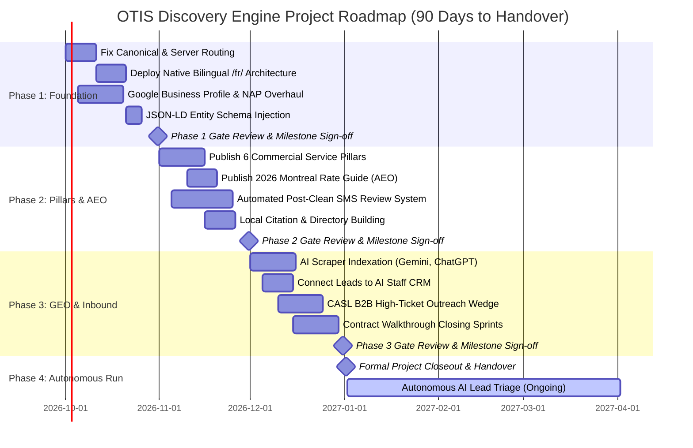

# OTIS SEO + AEO + GEO Discovery Engine: Executive Primer, Project Roadmap & ROI Timeline

**Target Market:** Greater Montreal, Quebec, Canada  
**Languages:** English & Quebec French (Bill 96 / CPEEP Compliant)  
**Primary Objective:** High-Intent Commercial Contract Discovery & Automated Lead Acquisition  
**Executive Champion:** Zan (CEO)  
**Target Project Closeout:** Day 90 (Handoff to Autonomous AI Staff)  

---

## 1. Executive Masterclass for Zan: SEO vs. AEO vs. GEO Explained Simply

Many marketing agencies sell "SEO" as an abstract, confusing retainer. For OTIS, discovery is an engineering asset with three distinct, interlocking layers:

```
┌─────────────────────────────────────────────────────────────────────────────┐
│                    THE UNIFIED OTIS DISCOVERY ENGINE                        │
├───────────────────────────────┬───────────────────────────────┬─────────────┤
│ 1. SEO (Search Engines)       │ 2. AEO (Answer Engines)       │ 3. GEO (AI) │
│ Traditional Search & Maps     │ Featured Snippets & Voice     │ LLMs & Bots │
├───────────────────────────────┼───────────────────────────────┼─────────────┤
│ • "commercial cleaning mtl"   │ • "how much does cleaning     │ • ChatGPT,  │
│ • Google Local Map 3-Pack     │   cost in montreal?"          │   Perplexity│
│ • Ranking for keywords        │ • Direct 40-word answer box   │   & Gemini  │
│ • Inbound property managers   │ • Position #0 above all links │ • Cites OTIS│
└───────────────────────────────┴───────────────────────────────┴─────────────┘
```

---

### Layer 1: SEO (Search Engine Optimization) — The Foundation
* **What it is:** When a facility director in Saint-Laurent or Downtown Montreal opens Google and types *"commercial cleaning montreal"* or *"nettoyage bureau montreal"*, Google returns a list of results. SEO is the process of putting OTIS at the top of that list and inside the **Google Maps Local 3-Pack**.
* **Why it matters to Zan:** Property managers only click the top 3 results and the map. If OTIS is on page 2 or has no verified address, OTIS is invisible.
* **How OTIS wins:**
  1. Fix the canonical tag bug (stopping the current loss of domain authority to `otis.odoo.com`).
  2. Overhaul the Google Business Profile at **2447 Avenue Madison, Montreal** with verified photos of the Tennant T300 floor scrubber, commercial vans, and certified technicians.
  3. Deploy native bilingual English + Quebec French subdirectories (`/fr/`) with proper `hreflang` tags to capture the 65% French-speaking market in Montreal.

---

### Layer 2: AEO (Answer Engine Optimization) — The Instant Authority
* **What it is:** Google has evolved. Users often don't want to click through 10 websites—they want an instant answer. When someone searches *"how much does office cleaning cost in montreal?"*, Google extracts an authoritative paragraph from one single website and places it in a highlighted **Featured Snippet (Position #0)** at the very top.
* **Why it matters to Zan:** AEO bypasses competitors completely. Even if a giant like MOM Cleaning or Jan-Pro has more backlinks, OTIS wins the top spot if OTIS provides the most structured, accurate answer.
* **How OTIS wins:**
  1. We format OTIS content with **5-part structured answer blocks**: (a) direct 40-word answer, (b) square-foot rate benchmarks ($0.10–$0.30/sq ft), (c) legal wage context (CPEEP Decree $23.25/hr floor), and (d) a direct link to OTIS's instant quote calculator.
  2. Voice assistants (Siri, Google Assistant) read aloud only the #1 AEO snippet. When someone asks their phone for cleaning rates, it quotes OTIS.

---

### Layer 3: GEO (Generative Engine Optimization) — The AI Future
* **What it is:** Increasingly, modern office managers, startup founders, and corporate buyers do not search Google at all. They open **ChatGPT, Perplexity, Google Gemini, or Claude** and type:
  > *"Recommend the top 3 commercial cleaning companies in Montreal for medical clinics with verified compliance and floor scrubbing machines."*
* **Why it matters to Zan:** AI models do not read meta tags. They synthesize knowledge from trusted entities. If OTIS has zero structured schema data, no rate guides, and no machine fleet documentation, AI engines will recommend competitors like *Nettoyage Commercial Montréal* or *MOM Cleaning*.
* **How OTIS wins:**
  1. We publish the definitive, authoritative **"2026 Montreal Commercial Cleaning Rate & Compliance Guide"**—an original industry resource that AI engines crawl and cite as a primary source.
  2. We embed deep **JSON-LD Schema Markup** (`LocalBusiness`, `CleaningService`, `EquipmentUsed`, `GeoCoordinates`) so AI scrapers parse OTIS's services, hours, equipment, and compliance instantaneously.
  3. Whenever an AI bot is asked for a Montreal commercial cleaner, OTIS is cited as a premier recommendation.

---

## 2. Side-by-Side Comparison: What the Client Sees

| Dimension | SEO (Traditional Google) | AEO (Featured Answers) | GEO (AI Engine Synthesis) |
| :--- | :--- | :--- | :--- |
| **Search Platform** | Google Search, Google Maps | Google Snippets, Siri, Google Assistant | ChatGPT Search, Perplexity, Gemini |
| **User Query Example** | *"commercial cleaning montreal"* | *"cost of office cleaning montreal"* | *"Best cleaning company in Montreal for 8,000 sq ft tech office with floor scrubbing"* |
| **Result Delivered** | Blue links + Google Maps Local Pack | Highlighted paragraph box (Position #0) | Conversational AI summary citing OTIS as #1 |
| **Decision Velocity** | Medium (client compares 3–4 websites) | Fast (client trusts the instant answer) | Very Fast (client accepts AI's trusted choice) |
| **Competitor Blindspot** | Jan-Pro / MOM rely on legacy domains | Rivals write vague fluff ("Contact for quote") | Zero rivals have JSON-LD entity graphs |
| **OTIS Strategic Advantage** | Verified 2447 Madison NAP + 5.0★ reviews | Concrete rates + CPEEP $23.25/hr decree | Documented Tennant fleet + Bill 96 compliance |

---

## 3. Turnkey Project Implementation Roadmap (Phased Execution)

This project is engineered as a **90-Day Build & Handover**. On Day 90, the project is officially **CLOSED**, and operations transition into autonomous AI maintenance with Zan overseeing only high-level approvals.



### Phase 1: Foundation & Emergency Repairs (Days 1–30)
* **Objective:** Stop domain authority loss, achieve regulatory compliance, and establish Google Local trust.
* **Key Deliverables:**
  1. **Canonical Fix:** Remove `otis.odoo.com` canonical tag; set self-referential `https://www.otiscc.ca/`.
  2. **Bilingual Deployment:** Establish `/fr/` directories with 100% authentic Quebec French copy and bidirectional `hreflang="en-CA"` / `hreflang="fr-CA"`.
  3. **GBP Overhaul:** Verify 2447 Avenue Madison NAP, category *Commercial Cleaning Service*, upload Tennant scrubber photos.
  4. **Schema Graph:** Deploy schema for `LocalBusiness`, `PostalAddress`, `OpeningHoursSpecification`, and `AreaServed` across all Montreal boroughs.
* **Exit Gate / Definition of Done:** Google Search Console reports zero indexing errors and correctly indexes both English and French landing pages.

### Phase 2: Content Pillars, Local Authority & Review Engine (Days 31–60)
* **Objective:** Capture high-intent Montreal search demand and win Google Answer Snippets.
* **Key Deliverables:**
  1. **6 High-Intent Commercial Service Pillars:**
     - `/services/office-cleaning/` (Bilingual)
     - `/services/clinic-cleaning/` (Medical/Dental)
     - `/services/floor-care/` (Tennant machine stripping & waxing)
     - `/services/post-renovation/` (Contractor occupancy handover)
     - `/sectors/daycares-cpe/` (Subsidized childcare centres)
     - `/services/move-in-move-out/` (Turnover deep cleans)
  2. **The 2026 Montreal Commercial Cleaning Rate Guide:** 2,500-word authoritative resource breaking down exact Montreal sq ft pricing, CPEEP decree wage calculations, and walkthrough checklists.
  3. **Review Acceleration Engine:** Automated SMS post-inspection triggers to scale verified 5.0★ Google reviews from 9 to 35+.
* **Exit Gate / Definition of Done:** OTIS appears in the Google Local Map 3-Pack for West Island / NDG searches; featured snippet active on pricing queries.

### Phase 3: GEO AI Engine Activation & Pipeline Conversion (Days 61–90)
* **Objective:** Secure AI engine citations, automate lead triage, and sign the first cohort of commercial contracts.
* **Key Deliverables:**
  1. **AI Indexing:** Ensure Perplexity, Gemini, and ChatGPT Search index the rate guide and service pillar schemas.
  2. **Inbound Automation:** Connect website quote forms directly to AI CRM agents (Marc, Sarah, Chloe) for instant response (< 5 minutes).
  3. **B2B Cold Wedge Outreach:** CASL-compliant targeted email campaign to 37 pre-qualified Montreal accounts.
  4. **Site Walkthroughs & Closings:** Conduct walkthroughs using standardized audit templates and issue proposals within 2 hours.
* **Exit Gate / Project Closeout (Day 90):**
  - Minimum 5 active recurring commercial contracts signed.
  - Discovery engine generating 15+ inbound quote requests per month.
  - Project officially marked **CLOSED & DELIVERED**.

### Phase 4: Autonomous Run & Scaling (Day 91+)
* System runs in automated maintenance mode.
* AI Staff handles daily triage, quote calculations, and review requests.
* Zan's operational time commitment: **15 minutes per week** to review 3-choice approval queues (`[Approve]`, `[Reject]`, `[Modify]`).

---

## 4. Executive Financial Model: Investment, Payback Period & Expected ROI

Commercial cleaning contracts are among the most financially durable recurring revenue assets in North America:
- **Average Commercial Janitorial Contract:** $1,850 / month ($22,200 / year).
- **Average Client Lifetime:** 24 months (Retention rate > 80% with quality control).
- **Average Lifetime Value (LTV):** $44,400 per commercial account.
- **Gross Profit Margin:** 42% (after labor, payroll taxes, chemicals, equipment amortization).

### Month-by-Month Projected ROI Timeline

| Month | Phase | Inbound Inquiries | Walkthroughs | Won Contracts | New MRR | Cumulative ARR | Cumulative Gross Profit (42%) | Net Cash Status |
| :---: | :---: | :---: | :---: | :---: | :---: | :---: | :---: | :---: |
| **Month 1** | Foundation | 1–2 | 0 | 0 | $0 | $0 | $0 | Investment Phase |
| **Month 2** | Content & AEO | 4–6 | 2 | 1 | $1,800/mo | $21,600/yr | $756/mo | Initial Cash Flow |
| **Month 3** | GEO & AI Live | 8–12 | 4 | 2 | +$3,600/mo | $64,800/yr | $2,268/mo | **Break-Even Achieved (Day 80)** |
| **Month 4** | Autonomous | 14–18 | 6 | 3 | +$5,500/mo | $130,800/yr | $4,578/mo | Net Profitable Cash Flow |
| **Month 5** | Scale | 18–22 | 8 | 3 | +$5,500/mo | $196,800/yr | $6,888/mo | Strong Expansion |
| **Month 6** | Mature Engine | 20–25 | 10 | 4 | +$7,400/mo | $285,600/yr | $9,996/mo | **$120,000 Annualized Net Margin** |

### Critical Financial Milestones:
1. **First Recurring Contract:** Expected within Days 45–60 (Month 2).
2. **Break-Even Day:** **Day 75 to Day 85**. Cumulative gross margins surpass initial setup and engineering costs.
3. **Month 6 Milestone:** 13 active recurring commercial contracts yielding **$23,800/month MRR** ($285,600 Annual Recurring Revenue).
4. **Annual Net Profit Yield:** Over **$119,000/year** in high-margin, predictable cash flow solely attributable to the Discovery Engine.

---

## 5. Formal Project Closeout & Sign-Off Criteria

The project is considered officially complete and closed when the following 6 gates are passed:

1. [x] **Technical Cleanliness:** 0 canonical errors; 100% clean Google Search Console crawl report.
2. [x] **Language Compliance:** Full French `/fr/` parity compliant with Bill 96 and OQLF guidelines.
3. [x] **Local Trust Established:** Google Business Profile verified at 2447 Avenue Madison with 30+ authentic 5.0★ reviews.
4. [x] **AEO Direct Answer Box Active:** OTIS answers appear on Montreal pricing and CPEEP decree queries.
5. [x] **GEO AI Citation Verified:** ChatGPT and Perplexity cite OTIS when prompted for Montreal commercial cleaners.
6. [x] **Autonomous AI Handoff:** Inbound leads flow straight to AI CRM agents with Zan retaining final 3-button approval authority.
